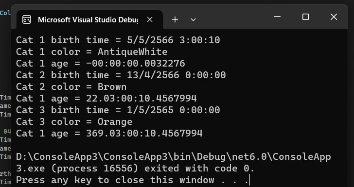

# 9.1 Constructor 

- Constructors เป็น method ที่มีชื่อเดียวกับคลาส

- ถูกเรียกใช้ทันทีเมื่อสร้าง instance ใหม่

- เป็นที่ที่เหมาะสำหรับการ initial ค่า state ต่างๆ ให้แก่ instance

- ถ้าต้องการให้สร้าง instance จากภายนอกคลาส ให้กำหนด modifier เป็น public

- constructor ไม่สามารถส่งค่ากลับ (ไม่ต้องใส่ชนิด return แม้กระทั่ง void)

## 9.1.1  ใช้ Instance constructors

รันโปรแกรมตามตัวอย่างนี้และบันทึกผล
``` cs
using System.Drawing;

namespace ConstructorExample
{
    class Cat
    { 
        // Properties
        public DateTime BirthTime { get; set; }
        public Color CatColor { get; set; }

        // Constructor
        public Cat() 
        {
            BirthTime = DateTime.Now;
            CatColor = Color.Transparent;
        }
    }
    internal class Program
    {
        static void Main(string[] args)
        {
            var c1 = new Cat();
            Console.WriteLine($"Cat birth time = {c1.BirthTime}");
            Console.WriteLine($"Cat color = {c1.CatColor.Name}");
        }
    }
}
```
ผลการรันโปรแกรม


## 9.1.2 Constructors with Parameters

- Constructors มีฐานะเป็น method สามารถรับ parameters ได้เช่นเดียวกับ method ทั่วไป ใช้รูปแบบของพารามิเตอร์เช่นเดียวกับ method อื่น ๆ และสามารถทำ overloaded ได้    

- ในขณะที่สร้าง instance คอมไพเลอร์จะเลือก constructor ที่มี signature ตรงกับ constructor ตัวหนึ่งขึ้นมาทำงาน

รันโปรแกรมตามตัวอย่างนี้และบันทึกผล
```cs
using System.Drawing;
namespace ConstructorExample
{
    class Cat
    { 
        // Properties
        public DateTime BirthTime { get; set; }
        public Color CatColor { get; set; }
        
        // Default constructor
        public Cat() 
        {
            BirthTime = DateTime.Now;
            CatColor = Color.Transparent;
        }
        // Parameterized constructor
        public Cat(Color catColor)
        {
             BirthTime = DateTime.Now;
             CatColor = catColor;
        }
    }
    internal class Program
    {
        static void Main(string[] args)
        {
            var c1 = new Cat();
            Console.WriteLine($"Cat birth time = {c1.BirthTime}");
            Console.WriteLine($"Cat color = {c1.CatColor.Name}");

            // Challenge:  use Parameterized constructor

            var ___ = new Cat(_______);
            Console.WriteLine($"__________________");
            Console.WriteLine($"__________________");
        }
    }
}
```
ผลการรัยนโปรแกรม


## 9.1.3 การใช้ this() เพื่อเรียก constructor

โดยปกติ เราไม่สามารถเรียกใช้งาน constructor ได้โดยตรง 

เมื่อผู้ใช้สร้าง instance โดยการป้อน parameters ตามที่ต้องการ compiler จะเเลือก overloaded constructor ที่มีรายการ constructor ตรงกันขึ้นมาทำงาน
ในจังหวะนี้เราสามารถเรียก constructor ตัวอื่นขึ้นมาทำงานโดยใช้ this(<parameters list>)

การเรียก constructor ตัวอื่น สามารถเรียกต่อกันเป็นลูกโซ่ได้ตามต้องการ


รันโปรแกรมตามตัวอย่างนี้และบันทึกผล

```cs
using System.Drawing;
namespace ConstructorExample
{
    class Cat
    {
        // Properties
        public DateTime BirthTime { get; set; }
        public Color CatColor { get; set; }
        public string?  Name { get; set; }

        // Default constructor
        public Cat()
        {
            BirthTime = DateTime.Now;
            CatColor = Color.Transparent;
        }
        // Parameterized constructor
        public Cat(Color catColor) : this() // เรียก default constructor
        {
            CatColor = catColor;
        }
        public Cat(string name, Color color) : this(color) // เรียก overloaded constructor 'public Cat(Color catColor)'
        {
            Name = name;
        }
    }
    internal class Program
    {
        static void Main(string[] args)
        {
            var c1 = new Cat("Jumbo", Color.AntiqueWhite);
            Console.WriteLine($"Cat birth time = {c1.BirthTime}");
            Console.WriteLine($"Cat color = {c1.CatColor.Name}");
            Console.WriteLine($"Cat Name = {c1.Name}");
        }
    }
}
```
ผลการรันโปรแกรม


## 9.1.4 Static constructor

รันโปรแกรมตามตัวอย่างนี้และบันทึกผล

```cs
using System.Drawing;
namespace ConstructorExample
{
    class Cat
    {
        // Properties
        public DateTime BirthTime { get; set; }
        public Color CatColor { get; set; }

        public static readonly DateTime globalStartTime;

        // Default constructor
        public Cat()
        {
            BirthTime = DateTime.Now;
            CatColor = Color.Transparent;
        }

        // Static constructor
        static Cat()  
        {
            globalStartTime = DateTime.Now;
        }


        // Parameterized constructor
        public Cat(Color catColor)  : this()
        {
            CatColor = catColor;
        }
        public Cat(Color catColor, DateTime born) : this(catColor)
        {
            BirthTime = born;
        }
    }
    internal class Program
    {
        static void Main(string[] args)
        {
            var c1 = new Cat(Color.AntiqueWhite);
            Console.WriteLine($"Cat 1 birth time = {c1.BirthTime}");
            Console.WriteLine($"Cat 1 color = {c1.CatColor.Name}");
            Console.WriteLine($"Cat 1 age = {Cat.globalStartTime - c1.BirthTime}"); 

            var c2 = new Cat(Color.Brown, new DateTime(2023, 04, 13));
            Console.WriteLine($"Cat 2 birth time = {c2.BirthTime}");
            Console.WriteLine($"Cat 2 color = {c2.CatColor.Name}");
            Console.WriteLine($"Cat 1 age = {Cat.globalStartTime - c2.BirthTime}");

            var c3 = new Cat() { CatColor = Color.Orange, BirthTime = new DateTime(2022, 05, 01) };
            Console.WriteLine($"Cat 3 birth time = {c3.BirthTime}");
            Console.WriteLine($"Cat 3 color = {c3.CatColor.Name}");
            Console.WriteLine($"Cat 1 age = { Cat.globalStartTime - c3.BirthTime}");
        }
    }
}
```
ผลการรันโปรแกรม



## 9.1.5 Object initializer

ในบางกรณี เราไม่สามารถสร้าง constructor หลายๆ ตัวเพื่อที่จะรับค่า parameters ที่แตกต่างกันเข้าสู่ object

ในภาษา C# มีวิธีการกำหนดค่าเริ่มต้นให้ properties ผ่าน Object initializer

รันโปรแกรมตามตัวอย่างนี้และบันทึกผล

```cs
using System.Drawing;

namespace ConstructorExample
{
    class Cat
    { 
        public DateTime BirthTime { get; set; }
        public Color CatColor { get; set; }
        public static int catID;
        public Cat() 
        {
            BirthTime = DateTime.Now;
            CatColor = Color.Transparent;
            catID++;
        }
        public Cat(Color catColor) :this()     
        {
            CatColor = catColor;
        }
    }
    internal class Program
    {
        static void Main(string[] args)
        {
            var c3 = new Cat() { CatColor = Color.Orange, BirthTime = new DateTime(2023, 05, 01) };
            Console.WriteLine($"Cat 3 birth time = {c3.BirthTime}");
            Console.WriteLine($"Cat 3 color = {c3.CatColor.Name}");
        }
    }
}

```
ผลการรันโปรแกรม


## คำถาม

1. ท่านคิดว่าวิธีการทำ constructor overloading แล้วเรียกต่อกันเป็นทอดๆ จะช่วยอำนวยความสะดวกอะไรในการเขียนโปรแกรมของท่าน
```
สามารถสร้าง object ได้หลายแบบตามความต้องการของโปรแกรม เช่น ถ้าเรามีคลาส Person และต้องการสร้าง object โดยมีการระบุชื่อและอายุของบุคคล โดย constructor ก็จะต้องมีพารามิเตอร์เหล่านี้ในการรับค่า แต่ถ้าเราไม่ต้องการระบุชื่อของบุคคลเราสามารถสร้าง constructor แบบที่ไม่มีพารามิเตอร์ชื่อได้ด้วยการทำ Constructor Overloading ซึ่งจะช่วยลดเวลาและลดความซับซ้อนของโค้ดในการเขียนโปรแกรมได้
```

2. เปรียบเทียบประโยชน์และข้อจำกัด ในการใช้ overloaded constructor และ Object initializer
```
Overloaded constructor
ประโยชน์
การกำหนดค่าเริ่มต้นของอ็อบเจกต์เมื่อสร้างขึ้นมา โดยสามารถกำหนดค่าได้หลายๆ แบบ โดยที่ไม่ต้องเขียนโค้ดเพิ่มเติมในภายหลัง
ข้อจำกัด
หากมีจำนวน constructor มากเกินไปอาจทำให้เกิดความสับสนในการเลือกใช้ constructor ที่ถูกต้อง และหากต้องการเพิ่มคุณสมบัติต่อไป อาจจะต้องเพิ่ม constructor ใหม่ ซึ่งอาจทำให้โค้ดยืดหยุ่นไม่ได้

Object initializer
ประโยชน์
ให้การกำหนดค่าเริ่มต้นของอ็อบเจกต์ได้อย่างง่ายดาย และยังสามารถกำหนดค่าของ property ได้หลาย property ในครั้งเดียว
ข้อจำกัด
ไม่สามารถกำหนดค่าแบบเงื่อนไขได้ และไม่สามารถกำหนดค่า property ที่ไม่มี setter ได้ นอกจากนี้ Object initializer ยังไม่สามารถกำหนดค่าอื่นๆ ที่เกี่ยวข้องกับอ็อบเจกต์ได้ เช่น การกำหนดค่า field และ method
```